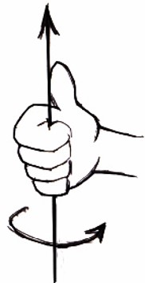
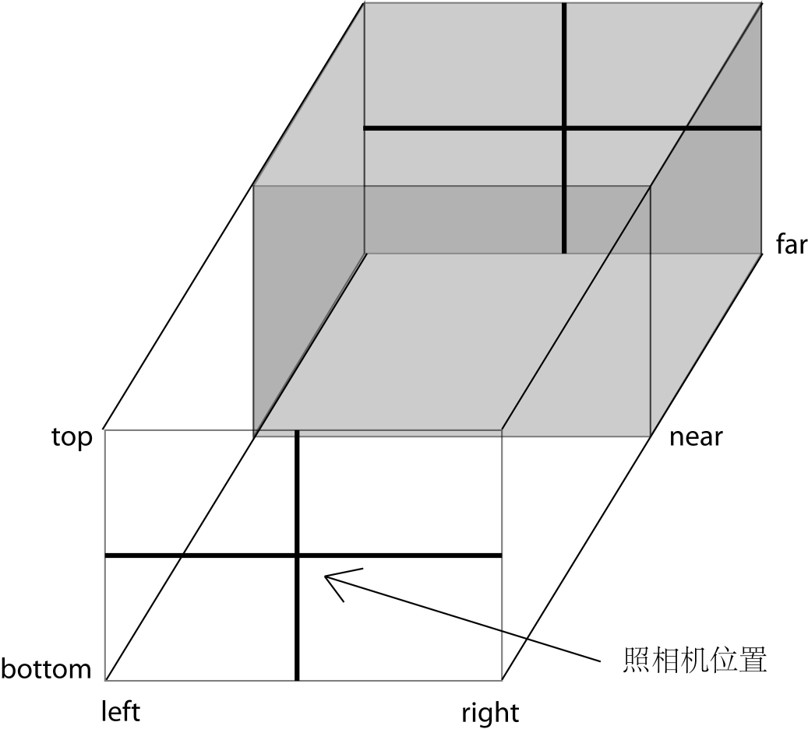

## 坐标系

屏幕向右为 x 正方向，向上为 y 轴正方向，屏幕向外为 z 正方向

## 旋转方向

拇指指向旋转轴的正方向，四指弯曲的方向为旋转的正方向

## 正投影相机

THREE.OrthographicCamera = function ( left, right, top, bottom, near, far）

## 透视相机

PerspectiveCamera( fov, aspect, near, far )

